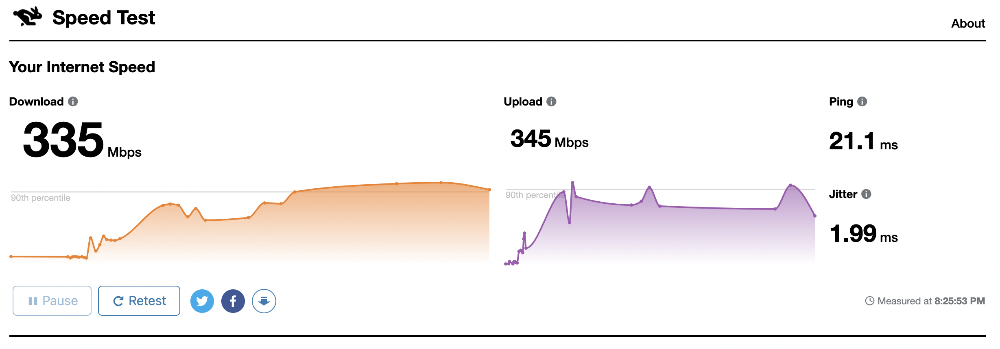

1年住んでいた筑波大学の宿舎からアパートに引っ越すことにした。
宿舎のネットワークは各部屋にルータとAPが設置されており、
入居者は勝手にルータとAPを設置することが出来ない（一部許可されてはいるものかなり限定的なのであまり意味がない）
そのためQNAPのQSW-M408Sのみを使っていたが、
新居では当然回線事業者とプロバイダから自力で設定する必要があるので
APとルータを新規で調達した。

## 機器

APは[FS](https://fs.com)の[AP-W6D2400C](https://www.fs.com/jp/products/108705.html)を直販で買ってルータはNECの[IX2215](https://jpn.nec.com/univerge/ix/Info/ix2215.html)をヤフオクで買った。
[AP-W6D2400C](https://www.fs.com/jp/products/108705.html)はWiFi6(802.11ax)対応で32個のSSIDを設定出来る。
SSID毎にVLANを設定出来るので上流側のルータで設定すればゲスト用のSSIDと自分用のSSIDでVLAN分離する事も出来る。
FS以外にもWiFi6対応のルータを販売しているのはUbiquitiなど複数あるが、FS以外だと在庫不足で調達出来ない事も多い上FSはコスパが良い。

IX2215は特別高性能という訳ではないがMap-EもDS-Liteも使え、IPSecでも1.3 Gbps出るので性能としては十分。

APの電源供給にはヤフオクで落としたPanasonicのM8eGPWR+を使っている。
PoE+（802.3at）対応8ポートのスイッチで安かったがファンレスでないのでかなりうるさい。
耐えられないわけではないが寝ることを考えるとやはり嫌ではあるのでFSでPoEスイッチを購入しようと思う。

メインのスイッチは元々使っていたQNAPのQSW-M408Sで、これはRJ45 1G x 8にSFP+が4 portのスイッチ。
VLANを切れるのでAPと組み合わせて使えばゲスト用ネットワークと個人のネットワーク環境を分離出来る、
がNAPT前提でプライベートネットワークを組むIPv4と違い
IPv6は端末までグローバルアドレスが降ってくるので単純にVLANを切ってもルータ内でルーティングされて分離が達成できない気がする。
後でルータの設定を見て対処したい

## 回線

NTT東のフレッツ光マンションタイプでISPはSo-netを契約した。
現在の新規契約だとIPv6+オプションがデフォルトで付いてくるらしく
IPoEの設定をすればPPoE無しでv4とv6の両方でインターネットに繋がる。

### ファームウェアアップデート

IX2215は中古で購入した場合ファームウェアが古いのでNECから
最新のファームを貰ってきて適当なPCでTFTPサーバを立てて
ファームウェアをアップデートする。
私はdnsmasqのTFTPサーバ機能で設定した。
以下が`/etc/dnsmasq.conf`。
TFTPのセキュアモードは使用しないので`secure-tftp`は入れなかった。

```text
enable-tftp
tftp-root=/srv/tftp
```

これで`/srv/tftp`以下にファームウェア（`.rap`で終わるファイル）を配置する
後はPCのRJ45をそのままIX2215に直結する。
ここではGE1にした（後で`192.168.1.1`振るし）

```bash
systemctl stop systemd-network.service
ip a add 192.168.1.2 dev enp9s0
systemctl start dnsmasq.service
```

でDHCPを止めてPCにIPアドレスを振りdnsmasqを起動する。

後はIX2215側での作業。

```text
interface GigaEthernet1.0
  ip address 192.168.1.1/24
  no shutdown
software-update tftp://192.168.1.2/xxxxxxxx.rap
reload
```

これでファームウェアの更新が終わり。

## IPoE設定

投入した設定は以下。[NECの設定ガイド](https://jpn.nec.com/univerge/ix/Support/ipv6/v6plus-mape/index.html)からの引用

```text
ip ufs-cache max-entries 20000
ip ufs-cache enable
ip route default Tunnel0.0
ip dhcp enable

ipv6 ufs-cache max-entries 10000
ipv6 ufs-cache enable
ipv6 dhcp enable

proxy-dns ip enable
proxy-dns ip request both

ip dhcp profile dhcpv4-sv
  dns-server 192.168.1.1

ipv6 dhcp client-profile dhcpv6-cl
  information-request
  option-request dns-servers

ipv6 dhcp server-profile dhcpv6-sv
  dns-server dhcp

interface GigaEthernet0.0
  no ip address
  ipv6 enable
  ipv6 traffic-class tos 0
  ipv6 dhcp client dhcpv6-cl
  ipv6 nd proxy GigaEthernet1.0
  no shutdown

interface GigaEthernet1.0
  ip address 192.168.1.1/24
  ip dhcp binding dhcpv4-sv
  ipv6 enable
  ipv6 dhcp server dhcpv6-sv
  ipv6 nd ra enable
  ipv6 nd ra other-config-flag
  no shutdown

interface Tunnel0.0
  tunnel mode map-e
  ip address map-e
  ip tcp adjust-mss auto
  ip napt enable
  no shutdown

write memory
```

## 実測

Macbook AirでWiFiからspeed.cloudflare.comに接続して計測した



割といいんじゃないでしょうか
