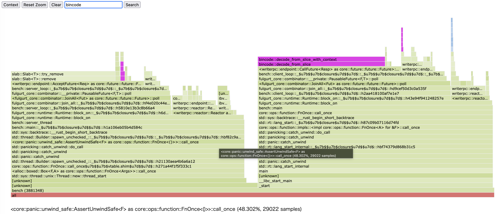
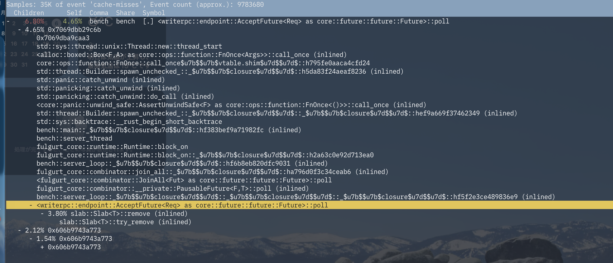
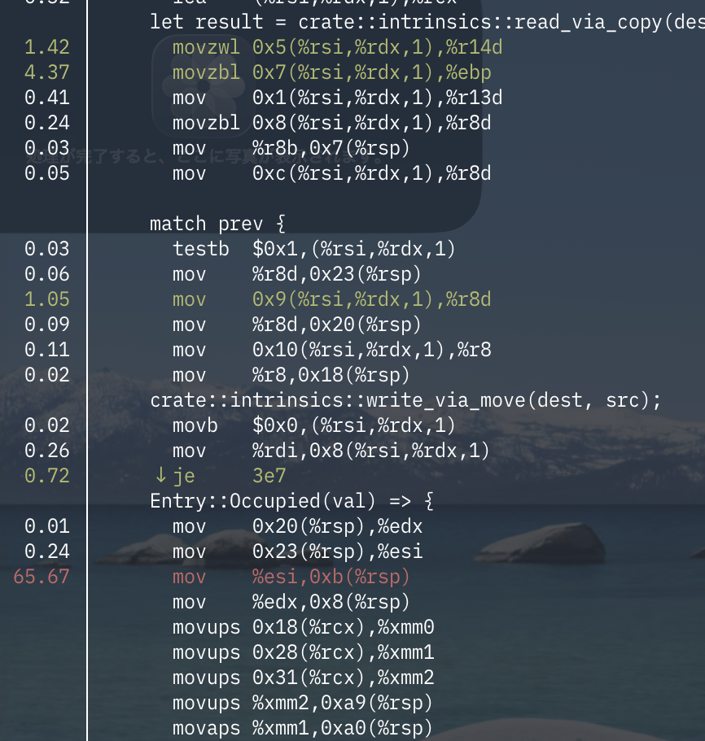

Rob pikeの有名な言葉の通り、パフォーマンスの定量的な計測（そして定性的な分析）はソフトウェアを書く上で重要だ。
[Intel VTune profiler](https://www.intel.com/content/www/us/en/developer/tools/oneapi/vtune-profiler.html)、
[Nsight systems](https://developer.nvidia.com/nsight-systems)といったイケイケのツール（特に後者はNICやGPU環境での最適化なら必須になってきている）に並ぶ便利ツールがLinux perf。カーネルツリーに入っているツールなので簡単に導入出来る。ただ、script（後述）だけはOS標準で入らない場合があるので適当にLinuxのソースコードから引っ張ってこないといけない。多少バージョン違っても大体動くので大丈夫。

## 準備

releaseビルドしてインライン化されていてもDWARFを使って解析が出来るが、そもそもデバッグ情報なしだとまともに動かない。
`release`プロファイルでも`debug`を有効化するか、丁寧にやるなら別途profileを作る。
依存crateにもdebuginfoを強制するために`profile.release.package.*`でも指定する。

```toml
[profile.release]
debug = true

[profile.release.package."*"]
debug = true
debuginfo = 2
```

## 計測と分析

以下のコマンドで実行。`-F`でサンプリング周期を変えても良い。あまりに長時間やると巨大なファイルになるので注意。
Rustの場合デフォルトではframe pointerからデバッグ情報を取れないので`--call-graph dwarf`をつける。
必ずしもrootで実行する必要はないが、ユーザ空間からだと`/proc/kallsyms`が見えずカーネル内部の情報が取れないのでrootの方が良い。
また、OS標準のaddr2lineだとRustのシンボルをうまく拾えない。[addr2line](https://crates.io/crates/addr2line)の
CLIを使うといい感じに出来る（よくわかんない）ので標準より優先されるようにPATHに入れる。


```sh
sudo perf record -g --call-graph dwarf ./target/release/binary
cargo install addr2line --features bin
# TUIで分析
sudo env PATH="$PATH:/home/namachan10777/.cargo/bin" perf report
sudo perf script report flamegraph
```


また、`/usr/libexec/perf-core/`以下にLinuxの`tools/perf/scripts`ディレクトリをコピーしておくと`perf script report flamegraph`で
`flamegraph.html`が生成される。カーネルランドとユーザランドが色分けされるのもあり、Brendan Gregg先生のスクリプトより若干便利。
出力は以下のような感じ



これは2スレッドなので2つ塊が出来る。自作ランタイム上でのRPCを分析したものだが、bincodeのdecodeがやたら重いことが読み取れる。
左上の検索ボックスを使うことで手軽に全体に占めるCPU実行時間の比率を分析出来るので便利。

より詳細な情報についてはperfのannotateを使う。`perf report`で開いて関数をannotateするのが便利。


とりあえず`mov`が遅いらしい。ただし、命令、特にメモリアクセス命令というのは単純に一律で実行時間がかかるものではない（その下のコピー命令が軽いことからも分かる）。おそらくはこの辺りでL1キャッシュをミスしてpipeline stallが起きている可能性がある。
オペランドの`esi`レジスタがすぐ次の命令で使われていることもこの推測を補強する。
あとは分岐予測ミスもあるかもしれない。下のコマンドで取って分析する。
この時`:pp`をつけておくとskidを防いで正確性が増す。

```sh
sudo perf -e branch-misses:pp,cache-misses:pp,cycles:pp --call-graph dwarf -- ./target/release/bench
```



あれ？そこまで高わけでもなさそう。



分岐予測も実は割とミスってる。が、実は`VecDeque`はもっとミスってる。つまり痛くはあるがそこまで時間がかかるわけではない。
ではそもそもパイプラインの遅延だろうか？この命令は次の命令に依存されているから先延ばしに出来ない。そして同じアドレスへの書き込みが上の方に存在する。なので単純にこの命令が遅いというよりは、分岐予測が起きやすくメモリコピーも多い中に、
OutOfOrderで実行しにくい命令があるのでそこに集中して見える、ということらしい。実際のこのあとハンドリングを改善してSlabを丸々抜いたがあまり変わらなかった……。

## まとめ

perfは単にflamegraphを取るだけのツールではなく、cache missや分岐予測ミスも収集出来る。
HWによってはPCIe関連のメトリクスも取れる。
暇だったらPCIeのことも後で書く。
