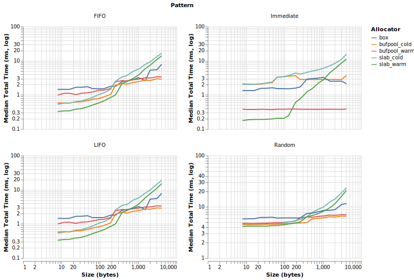
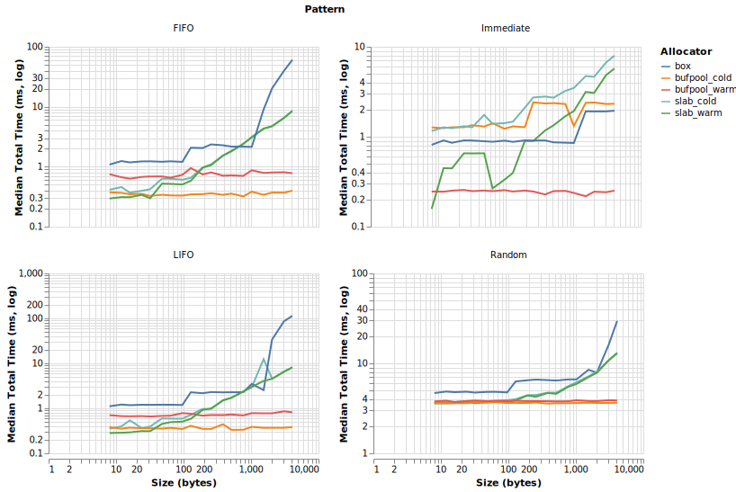
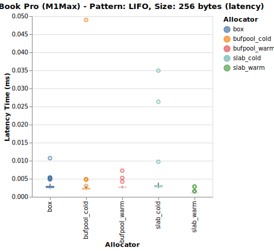

---
id: 2025/rust-alloc-bench
tags: ["tech", "rust", "system-software"]
date: 2025-12-02
description: Rustのslab crateについての解説と、Boxとのベンチマーク
title: SlabアロケータとRust
publish: true
---

Rustで高速なソフトウェアを書こうとしたときに、メモリアロケーションのオーバーヘッドを削りたくなるのは誰でも抱く感情だと思う。
実際やってみるとメモリアロケーションアルゴリズム本体は別にボトルネックじゃないという事が結構多いのだが、
とはいえ依存するクレートが限界まで高速化されていた方が最適化はやりやすいし、
デファクトである[serde](https://crates.io/crates/serde)の[API](https://docs.rs/serde/latest/serde/trait.Deserializer.html)を見ても最適化は前提なしに良いという価値観があるように思う。

高速アロケーションを実現するクレートの代表に[slab](https://crates.io/crates/slab)がある。
固定長（というか、固定の型）だけに限定はされるものの、固定長であることを活用して空きリストを効率的に管理しメモリフラグメンテーションを防ぎながら高速な割り当てを実現する。ソースコードを見れば単純で確かに速そうなのだが、glibcのmallocも相当使い込まれているはずで果たして本当に速いのか？というのが気になる。ちょうど研究でslabで実装するか、単純に`Box`を使うか迷ったため簡単なベンチマークを取った。

## 実験

4種類のアクセスパターンで比較。実装はSlab、Slab（ウォームアップなし）、Box、bufpoolの四種類。
実験環境としては手元のMacBook Pro(M1Max)と大学のIntel(R) Xeon(R) Platinum 8468で比較。

bufpoolは自作のアロケータで、Boxで確保したバッファへのポインタをSlabで管理する。Slabの高速なスロット管理とBoxのアドレス安定性を両立させる狙いがある。

#### LIFO (Last In, First Out)
スタック的なパターン。最後に確保したものを最初に解放。

```
stack = []
for i in 0..BATCH_SIZE:
    stack.push(alloc())
while stack is not empty:
    dealloc(stack.pop())  # 逆順
```

#### FIFO (First In, First Out)
キュー的なパターン。最初に確保したものを最初に解放。

```
queue = []
for i in 0..BATCH_SIZE:
    queue.push(alloc())
for ptr in queue:  # 順番通り
    dealloc(ptr)
```

#### Random
ランダムにalloc/deallocを混ぜる。スロットを選んで空ならalloc、埋まっていればdealloc。

```
slots = [None] * BATCH_SIZE
for i in 0..(BATCH_SIZE * 2):
    idx = random(0, BATCH_SIZE)
    if slots[idx] is not None:
        dealloc(slots[idx])
        slots[idx] = None
    else:
        slots[idx] = alloc()
# 残りを解放
for ptr in slots:
    if ptr is not None:
        dealloc(ptr)
```

## 結果

下に合計実行時間を示す。`BATCH_SIZE`は100。バッチの実行回数は$10^5$。



Boxは一定のバイト数まで一定の時間なのに対して、Slabアロケータは確保容量が小さいほど高速である。そしてSlabはウォームアップした方が明らかに速い（当然だが）。基本的には適切にSlabの初期容量を定め、小さな（256 byte以下）容量の確保であればSlabを使った方が高速だし、逆に大きなバッファになってきた場合もSlabの方が高速。素直なパフォーマンスと言える。部分的にBoxが勝っている場合もあるが、基本的には使えるならSlabを使った方がいいと言える。
bufpoolは追加操作が多いので当然Slabよりは遅いが、Boxよりは大体高速。そして使い回しを行なっているのでサイズに対してスケールする。



Intelの方も見てみよう。安定はしないものの大まかな傾向は同じなので、アーキテクチャには大きく依存しないことがわかる。



M1Max、LIFO、256バイトでのレイテンシも見てみよう。
BoxもSlabも割と安定しているが、coldでかなり大きく跳ねている部分がある。これはSlabの総容量を拡張する際に、
既存の部分を全てコピーして拡張する必要があるためだ。Intelの方にこれがないのは間引いてサンプリングしているため観測されなかったのだと思う。
ちなみにこのようにSlabは再確保があるため、アドレスを直接利用するのは控えた方がいい。

## まとめ

Slabの方が基本的に速いし素直な特性をしている。
アドレスの永続性が不要で、かつバッファサイズが小さい場合は素のslabを使う、
それ以外はBoxで確保した領域をslabで使い回すのが良さそうだ。
Boxはサイズが不明な時にこそ価値があるが、最適化したいならSlabアルゴリズムが優位。

実験に使ったコードは https://github.com/namachan10777/memalloc-bench に置いてある。
