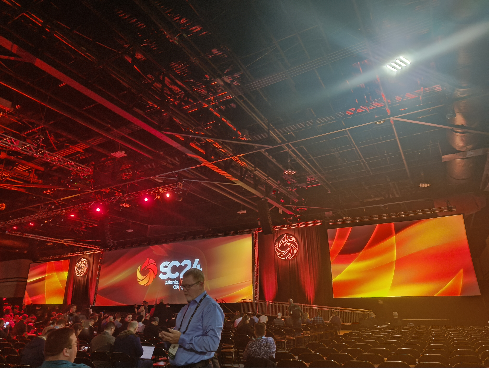
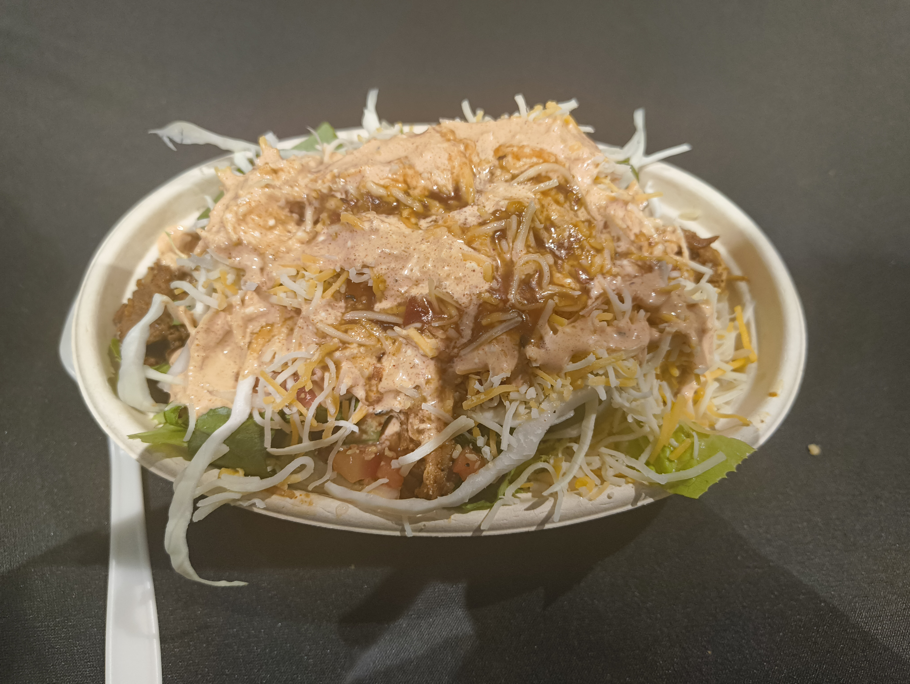
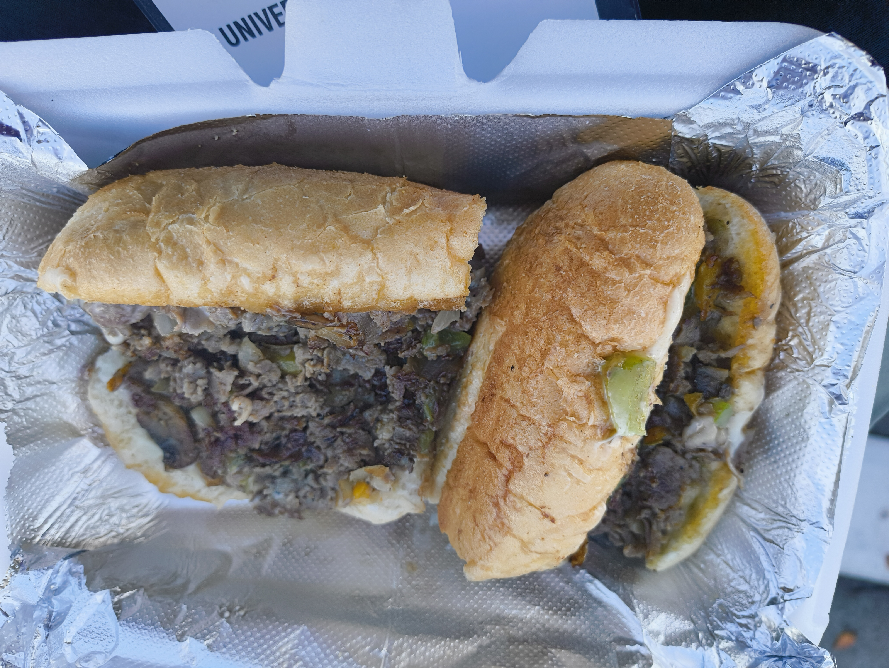
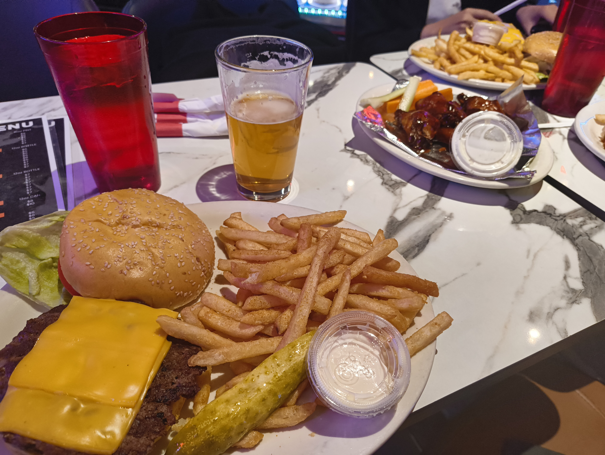

大学のブースの手伝い兼勉強としてSC24に行ってきた。
SC24はHPCにおける最大の学会で、企業展示が500社、一週間にわたって朝から夜まで並行して何本も口頭発表やワークショップが開催される巨大な学会。
今年の開催地はジョージア州アトランタで、来年はセントルイスらしい。

## 企業展示

### DDN, PureStorage, WekaIO, VAST, VDURA and NetApp

技術的なデモや展示というよりは製品の営業という雰囲気が強かった。
VDURAは元Panasas。
VASTのユーザー単位で帯域割り当てられるのは便利だな〜という感じ。Wekaの製品もよく知らなかったが、ObjectStorage backupedな高性能オンプレストレージらしい。運用側としては高頻度のデータはローカルのクラスタで保持しておきたいが、長期間使われないデータは自動でクラウドに上げてオンプレクラスタのストレージ使用量を安定させるのはとても嬉しいので、結構嬉しい製品だなと思った。
PureStorage、NetAppはあまり話を聞いていないのでよくわからない。DDNもあまりパネルとかは置いてなくて多分ExaScalerの営業をしていた（っぽい？）

純粋にストレージの性能を売る企業よりもAIワークロードが早くなるみたいな売り方をしていた企業が多かった。
やっぱり流行りというのもあるし、トータルソリューションの方が利益率が上がるというのもあるんだろう。

### Sumsung

会場には韓国連合ブースがあったが、Sumsungは流石に独立ブース。
[CXL](https://computeexpresslink.org/)色が全開で出ている展示だった。CXL接続のDRAM、CXLで接続されるBattery-Backuped DRAMとSSDによるNVRAMソリューションとかがメイン。
一応チップそれ自体の展示もあった。

NVRAMは多分[eADR](https://www.intel.com/content/www/us/en/developer/articles/technical/eadr-new-opportunities-for-persistent-memory-applications.html) みたいなものは無いので、
明示的にキャッシュラインをフラッシュしたりする必要がある。
また、IOMMUがL3キャッシュに書く場合とか色々面倒なことは多分多いはず。
それでもCXL接続のNVRAMが一応とはいえ出てきたのは嬉しい。

結構CXL対応に力を入れているようだし、SumsungはFlashベースのpmemを作っているので色々新製品が出てきそう。

### SK Hynix

ここも一応CXL対応は力を入れている。
が、メインはNear storage computingらしい。
彼らはFTLで計算が出来るようになると計算後のデータだけをPCIeに流せば済むし、FTL内部のスケジューリングも最適化出来ると考えているらしい。
実際にObject storageの展示もあった（ただアクセスはSQLでやるらしい。それはRDBMSでは……？）
ちょっと謎。HotchipsでもNear-storage computingだ！って言ってたらしいのでそう言う方針なんだと思う。

### Panmnesia

韓国企業連合ブースにもCXL連合ブースにもいなかった韓国のCXLベンチャー。
CXL 3.1対応のスイッチの展示をしていた。まだFPGA実装だが来年にはASICに焼くらしい。
他の企業はCXLとは言っても2.0までだったので明らかに最先端を突き進んでいる。

### CXL連合

Memory nodeとcomputing nodeで動的にメモリをやり取りするデモを結構やってた。
NUMAとして直接見えるし、numactlを`watch`すると動的にメモリ容量が変わっていくのが見えた。すごい。
devdaxとかfsdaxとしても見えるようで、CXLメモリを使ったファイルシステムの展示もあった。
ただ製品はCXL 2ばっかりで、ラック内でExclusiveなアクセスしか出来ないから出来ることはそこまで多くはない。

### Fujitsu

汎用ARM64プロセッサのmonakaを説明していた。モノ自体はまだ出来ていないが、しばらくしたら出てくるらしい。
他は量子コンピューターとHPCシステムのスライドとかがメイン。

### PFN

MN-CoreでStable diffusionを動かすライブデモとSC直前に発表した推論用チップL1000の展示。
チップの展示をしに来たのだがAIモデルの展示と勘違いされることが結構多かったらしい。
確かに会場にあったMN-Core開発キットは普通のデスクトップマシンにしか見えない……。

### その他

Celebrasのクソデカチップがあって良かった。マジでデカすぎる。

結構面白かったのはチップ企業やストレージシステム企業以外に、
冷却装置や電源装置の会社が多かった。
確かにHPCの規模なら冷却や電源装置も大きな市場になるんだろう。

大学の展示も結構多い。基本はポスターを貼った上で担当者が座っていると言う感じ。
自分も店番を担当したが、結構他の研究者や営業の人の訪問が多かった。

## Tutorial

Parallel I/O in Practiceが良かった。HPC環境の並列I/Oについてざっと上から下まで全部攫う感じ。500ページもスライドがあり、当然時間が足りないので結構飛ばしていた。
資料だけでもかなり有用なので良い勉強になる。
他にはSmartNICやDAOSのTutorialもあった。

## 研究発表

覚えているものだけ。

### [DFTracer](https://dftracer.readthedocs.io/), [DFAnalyzer](https://hpcdb.github.io/armful/dfanalyzer.html), [WisIO](https://grc.iit.edu/research/projects/wisio/)

ゲッティンゲン大の人のTalk。研究発表ではなくBoFだけど。

DFTracerはApplication levelからLow levelまでのI/Oを解析するツール。
アプリケーションのTraceについてはC/C++のライブラリとPythonのライブラリがあるのでそれを使う。
Low levelというのはPOSIX I/Oまでの話で、あくまでHPCアプリプログラマから見た低レベルということらしい。
HPCにおけるI/Oはかなり複雑で、ノードを跨いでジョブが実行される上にユーザーは直接syscallを呼ばず、
MPI-IOやHDF5などを使ったりする。しかもPythonのフレームワーク内部で書き出したりもするのでftraceとかだと高いレイヤの部分の解析が難しい。

この手のツールに似ているものとしてはDarshanがあるが、こちらは時系列解析は出来ないしアプリケーションレベルの解析も出来ない（後者に関してはソースコード変更が不要なのが売りなので、そこは仕方ない）。
また、シングルノード内に限ればPerfettoもある。こちらはAndroid用だがLinuxdでも普通に使える。
このPerfettoはトレース取得とは別にWeb UIもあり、これが便利なので他のプロファイラでもフォーマットを流用して使われたりしている。

DFAnalyzerはDFTracer用の解析ツール。WisIOはどうも開発して使っているグループが同じ（？）らしい。

### Coxial

一言で言うとDDRは古い！これからはCXLだ！という話。

DDRは既知の問題としてとにかくピン数が多い。LPDDR5だと160ピンも必要になる割に、メモリバンド幅があまり稼げない。
HBMでもあまり問題は解決していない。このピン数の多さは結構な問題で、メニーコア化が進む現代のxPUで十分なメモリを確保しようとするとBGAパッケージのピンをメモリが大幅に食ってしまう。
その点でCXLは同じようなバンド幅で32ピンで済むので、物理ピン数あたりのバンド幅を5倍出せる。

ここだけ聞くとそれはそうかもしれないが、それってレイテンシとか大丈夫なの？という疑問が湧く。
実際ベストなレイテンシで言うとCXLはLPDDRの数倍のレイテンシが掛かるが、
DDRでもコマンドキューが詰まるとレイテンシが悪化する。
そうなってくるとCXLでバンド幅を稼いだ方がメモリインテンシブなアプリケーションではむしろレイテンシも下がるので有利らしい。

実際、最近のDNNだと特に推論フェースではメモリバンド幅が性能を決定することになる。
典型的なアクセラレータが自前でメモリを持っていたり、HBMで接続したりするのはこのメモリアクセスが理由だ。
ただこのホストマシンとメモリが分離されたアーキテクチャは結構面倒な上に
オーバーヘッドもかなり大きい。NVIDIAは[GPU Direct](https://developer.nvidia.com/gpudirect)を導入して軽減を狙ったり、
[Grace Hopper](https://www.nvidia.com/ja-jp/data-center/grace-hopper-superchip/)でCPU-GPUでのメモリ共有とかをやっている。
CXLはそもそもノード間メモリ共有をやるプロトコルなので、CPUとGPUのメモリ共有も当然出来るはず。
なのでそもそもCPUもCXLでメモリにアクセスするというのも結構現実的なのかもしれない。

### CoRD

[EC: Erasure coding](https://en.wikipedia.org/wiki/Erasure_code)を高速化する手法。
ECは基本的にはブロック単位で[Reed-Solomon符号](https://en.wikipedia.org/wiki/Reed%E2%80%93Solomon_error_correction)だとか、
縦横斜めにパリティを取るといった手法で実装される。
これを実際のストレージクラスタで使おうとするとどう更新を並行して処理するかと言う問題が出てくるわけで、
ECの線形性を使い差分更新しつつ一箇所のノードで一旦Aggregateしてトラフィックを最適化すると言う研究。

### MegaMmap

VLDBみたいなmmapを改造する話ではなくdistributed memory。
ユーザー側でアクセスパターンを指定することで高速でスケーラブルな分散メモリを作ったよ、と言う話らしい。

### Airbiter2

HPCのログインノード（いわゆる踏み台サーバ的なノード）は
単に踏み台としてだけではなく、プログラムのコンパイルやデータの軽い処理などのInteractiveな処理を行うノードになる。
ここのリソースを誰かが使いすぎると他のユーザーが困る。が、単に固定でリソースを割り当てるわけにはいかない。
コンパイルにリソースを使うのは当然のことで、瞬間の高負荷は許容するが継続的な高負荷はうまく制限する必要がある。

そこでVictoria MetricsとPrometheusでリソース使用状況を収集し、Goのデーモンでcgroup使ってリソースを制限することでうまく解決したと言う話。
ポリシーをPromQLで書くことでシンプルに作ってある上に、クラスタ管理者は新しい言語を学ぶ必要がないので管理が楽。
上手いエンジニアリングだと思う。

## アメリカ生活

物価が高い……。単純な為替レートに加えてインフレの進行があるようだった。
食事自体は米以外は結構美味しい。
特に牛肉は味が濃くて良かった。

ここには載せていないが、SC24はTutorialかWorkshopに登録していれば
無料の軽食が提供される。ExhibitorであればExhibitor向けの軽食もある。
事前登録等が必要だが、Weka、DDN、AWS、AMD等結構な企業がReception Partyを開いている。
これらは学生でも登録出来るものも多く、無料で食事と飲み物が提供される。
アメリカの物価は日本人には苦しいのでこの辺りの無料の食事を活用しないと結構大変。

治安は割と良い。アトランタは比較的治安が悪いと言われていたが、それほど危険は感じなかった。
ただ、職業とエスニシティがほぼ完全に一致しており、あまり経済格差の緩和はうまく行ってないらしい。

## まとめ

規模の大きい学会だけあって企業展示も学会部分も楽しいので論文出してまた行きたい。
